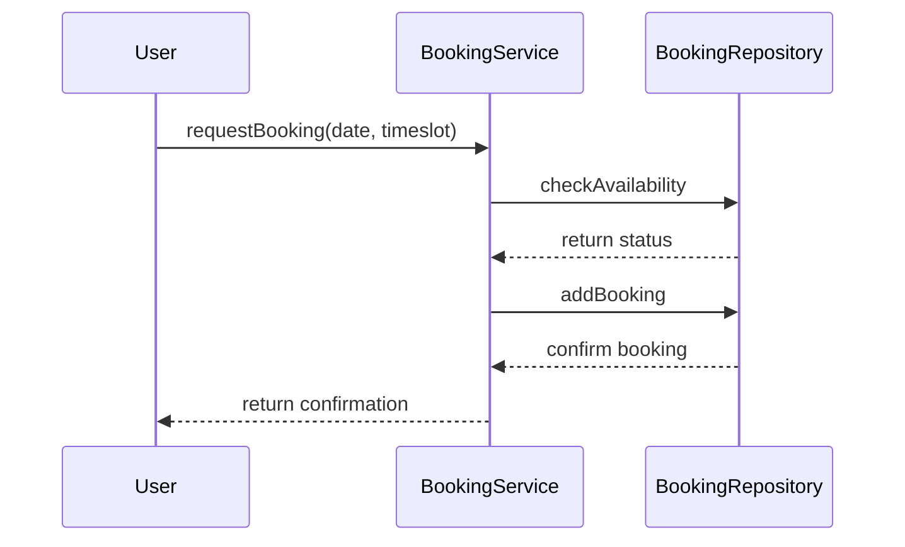

# Sekvensdiagram för Bokningsprocessen

```mermaid
sequenceDiagram
    participant User
    participant BookingService
    participant BookingRepository

    User ->> BookingService: requestBooking(date, timeslot)
    BookingService ->> BookingRepository: checkAvailability
    BookingRepository -->> BookingService: return status
    BookingService ->> BookingRepository: addBooking
    BookingRepository -->> BookingService: confirm booking
    BookingService -->> User: return confirmation
```